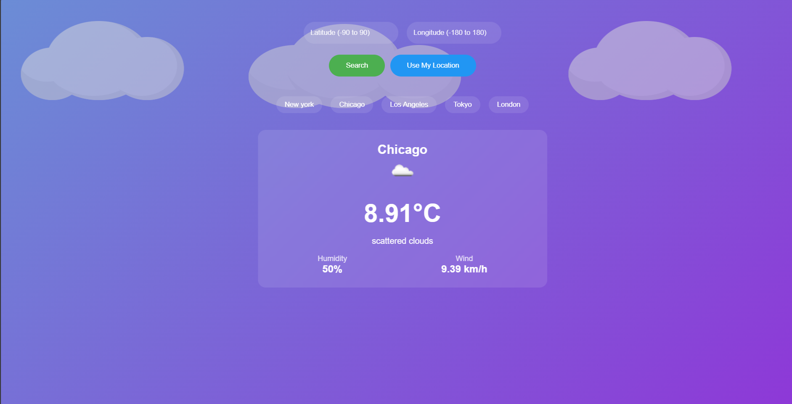

# 🌦️ React Weather App

A simple weather app built with React that fetches real-time weather data based on user location and city search. 🔥

## 🌟 Features

✅ Get current weather based on user location 📍  
✅ Search for weather in any city 🌍  
✅ Display temperature, humidity, wind speed, and weather conditions 🌡️💨  
✅ Responsive design for mobile & desktop 📱💻  
🛠️ **Coming Soon:** Toggle between Celsius & Fahrenheit 🔄  

## 🚀 Tech Stack

- ⚫ **React** – Frontend framework  
- 🌐 **OpenWeatherMap API** – Fetch real-time weather data  
- 🎨 **Tailwind CSS** – Styling  
- 📡 **Fetch API / Axios** – API requests  

## 🛆 Installation

1⃣ **Clone this repository:**  
```bash
git clone https://github.com/Aym-Aymen777/react-weather-app.git
```

2⃣ **Navigate to the project folder:**  
```bash
cd react-weather-app
```

3⃣ **Install dependencies:**  
```bash
npm install
```

4⃣ **Create a `.env` file** in the root directory and add your OpenWeatherMap API key:  
```env
REACT_APP_WEATHER_API_KEY=your_api_key_here
```
===note:this if you use an other API witch require an API key 
        but in this app we don't use this kind of APIs 
5⃣ **Start the development server:**  
```bash
npm run dev
```

## 🎥 Live Demo  

🚀 **[View Demo](./src/assets/demo.mp4)**  

## 🖼️ Screenshots  

  

## 🔧 How It Works  

1⃣ The app detects the user's location & fetches weather automatically.  
2⃣ Users can search for any city using the search bar.  
3⃣ Weather details (temperature, humidity, wind speed, etc.) are displayed beautifully.  
4⃣ More updates coming soon! 🚀  

## 🤝 Contributing  

🙌 Contributions are welcome! Feel free to fork this repository and submit a pull request.  

## 🐟 License  

💡 *Made with ❤️ by [C.Aymen](https://github.com/Aym-Aymen777/)*

